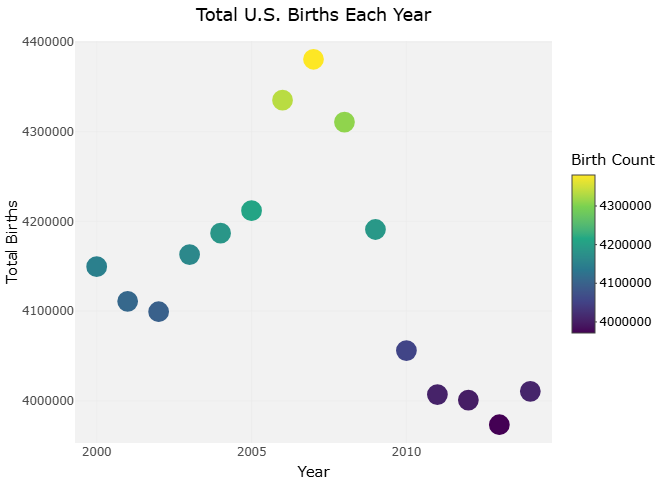
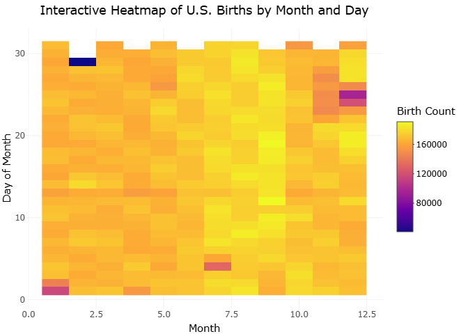
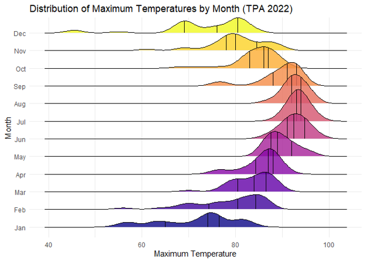
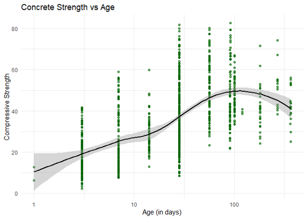

# Data-Visualization-and-Reproducible-Research---Final-Project

# Data Visualization and Reproducible Research

> Carlos Luis Molina Montero

The following is a sample of products I created during the _"Data Visualization and Reproducible Research"_ course in Florida Polytechnic University.

## Motivation

The goal of this project and this course as a whole was to develop a deeper understanding of real-world data through visualization and exploratory data analysis techniques in R. 
The project focuses on 3 applied datasets: Total US Births (2000 to 2014), The Florida climate data from Tampa International Airport and a concrete compressive strength dataset from the UCI Machine Learning Repository. 
The dataset for Total US Births (2000 to 2014) was personal choice because I was very interested to see if there was correlation between the decreasing US Birth rate and the patterns of births throught each year.
The Florida Climate and concrete compressive datasets were selected because they represent real engineering and environmental systems where relationships between variables are complex, nonlinear, and highly relevant to practical decision-making.

A key motivation behind this work was to strengthen data visualization skills using ggplot2 and related tidyverse tools while interpreting meaningful patterns in scientific and engineering contexts.

## Data Description

- For Projects 1 & 2, I used one primary dataset: 

US Births from 2000 to 2014 dataset: Provides a complete history of the total numbers of babies born within this time frame specifying day, month, and year.

- For Project 3, I used two primary datasets:

Tampa International Airport Weather Data (2022):  This dataset includes daily weather observations such as maximum temperature, minimum temperature, average temperature, and precipitation. The data is structured by year, month, and day, allowing for time-based analysis and seasonal comparisons. Missing or invalid values are encoded using sentinel values such as -99 or similar placeholders, which were handled during pre-processing.

Concrete Compressive Strength Dataset (UCI Repository): This dataset contains 1,030 observations of concrete mixtures with 8 input variables and 1 target variable. Inputs include material proportions such as cement, water, fly ash, and aggregates, as well as curing age in days. The output variable is concrete compressive strength measured in megapascals (MPa). This dataset is widely used in civil engineering and machine learning due to its nonlinear relationships between composition and strength.

## Project 01

In the `project_01/` folder you will find an improved version of my original visualization and analysis for this dataset.
My data visualization was converted from a static scatterplot/line chart into an interactive Plotly visualization. 
The updated chart allows users to hover over each year to view exact birth totals and includes both points and a connecting trend line to better emphasize overall changes over time. 
A colorblind-safe Viridis palette was also introduced to improve accessibility and ensure that color encoding remains clear for all users.
Please keep in mind that the visualization shown below is simply a picture of it, the real interactive visualization can be found with its code in the `project_01/` folder.

**Sample of Data Visualization:** 

## Project 02

In this project, I searched and tried to identify any seasonal and daily birth patterns in the US. 
The original static heatmap was converted into an interactive Plotly-based visualization. 
The new version allows users to hover over each tile to retrieve exact birth counts for specific month-day combinations. 
The color scheme was replaced with a Viridis gradient to enhance accessibility and remove reliance on non-colorblind-safe palettes. 
These updates strengthen the visualization by making it easier on users to identify trends, clusters, and anomalies that were less accessible in the original static version. 
Please keep in mind that the visualization shown below is simply a picture of it, the real interactive visualization can be found with its code in the `project_02/` folder.

**Sample Data Visualization:** 

## Project 03

In this project, For the Tampa weather dataset, histograms, density plots, and ridge plots were used to examine how maximum temperature varies across months, revealing clear seasonal patterns, differences in variability, and shifts in distribution over time. 
Precipitation was also analyzed to highlight its irregular and highly variable nature across the year. 
In the concrete strength dataset, visualizations focused on understanding how material composition and curing age influence compressive strength. 
Distribution plots helped characterize input variables such as cement and water, while scatterplots and smooth trend lines revealed nonlinear relationships between cement content, curing time, and strength development. 
Overall, these visualizations transformed raw tabular data into a much easier to understand groups of data that an audience including engineers or non-engineering individuals could interpet.
You can find all of the data visualizations with their codes and report in the `project_03/` folder.

**Sample Data Visualizations:** 

_[include your favorite visualization from this project here]_

### Moving Forward

In this course, I learned how to make effective data visualizations from different types of data using very useful tools such as ggplot and tidyverse.
Now understand that in order to deliver the insights of a complex dataset, you need to tell a "story" through the data visualizations so the audience truly understand the big picture behind it.
I also learned what are some design choices that are bad practices if you can to make great data visualizations. 
Before this course, I had little experience working in R studio. After completing this course, I understand and I am much more skilled using R studio. 
I am thankful for all that I learned in this course, but I know there is much more that I need to know to keep growing as an excellent professional designer. 
Some of these things I want to focus on the future are:

- Extending weather analysis to multi-year datasets to identify long-term climate trends rather than single-year patterns.

- Applying clustering techniques to identify natural groupings in concrete mixtures or weather patterns.

- Enhancing visual analytics with interactive dashboards using shiny for real-time exploration.

- Investigating additional environmental variables (humidity, wind speed) to improve weather-based insights.

- Potentially learn how to use other types of software to make more data visualizations or deeper analysis of the dataset.

