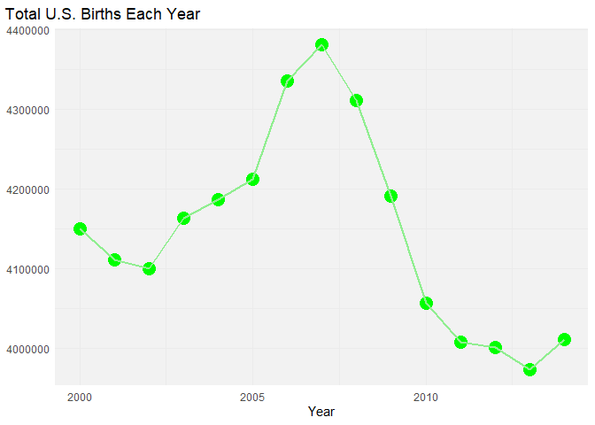

# Data Visualization Project 01

This was favorite plot from project 1 that I did previously. It was updated and improved by transforming the previous static scatterplot into an interactive time-series visualization using Plotly. It allows users to hover over individual years to view the exact number of US births for each year. By including the colorblind-safe viridis palette, the accessibility of this plot was increased significantly. This plot effectively displays long term pattern of US Births within the specific time period of dataset which is 2000 to 2014. 


- BEFORE IMPROVEMENT:

<!-- -->


- AFTER IMPROVEMENT, NOW IT IS AN INTERACTIVE DATA VISUALIZATION:


```{=html}
<div class="plotly html-widget html-fill-item" id="htmlwidget-a650e3800eb7ea472012" style="width:672px;height:480px;"></div>
<script type="application/json" data-for="htmlwidget-a650e3800eb7ea472012">{"x":{"data":[{"x":[2000,2001,2002,2003,2004,2005,2006,2007,2008,2009,2010,2011,2012,2013,2014],"y":[4149598,4110963,4099313,4163060,4186863,4211941,4335154,4380784,4310737,4190991,4055975,4006908,4000868,3973337,4010532],"text":["Year: 2000 <br>Total Births: 4149598","Year: 2001 <br>Total Births: 4110963","Year: 2002 <br>Total Births: 4099313","Year: 2003 <br>Total Births: 4163060","Year: 2004 <br>Total Births: 4186863","Year: 2005 <br>Total Births: 4211941","Year: 2006 <br>Total Births: 4335154","Year: 2007 <br>Total Births: 4380784","Year: 2008 <br>Total Births: 4310737","Year: 2009 <br>Total Births: 4190991","Year: 2010 <br>Total Births: 4055975","Year: 2011 <br>Total Births: 4006908","Year: 2012 <br>Total Births: 4000868","Year: 2013 <br>Total Births: 3973337","Year: 2014 <br>Total Births: 4010532"],"type":"scatter","mode":"markers","marker":{"autocolorscale":false,"color":["rgba(43,128,141,1)","rgba(54,104,140,1)","rgba(58,97,139,1)","rgba(44,136,139,1)","rgba(42,150,136,1)","rgba(36,164,133,1)","rgba(185,220,66,1)","rgba(253,231,37,1)","rgba(144,212,77,1)","rgba(41,152,136,1)","rgba(65,69,135,1)","rgba(70,35,105,1)","rgba(70,30,101,1)","rgba(68,1,84,1)","rgba(70,37,107,1)"],"opacity":1,"size":18.897637795275593,"symbol":"circle","line":{"width":1.8897637795275593,"color":["rgba(43,128,141,1)","rgba(54,104,140,1)","rgba(58,97,139,1)","rgba(44,136,139,1)","rgba(42,150,136,1)","rgba(36,164,133,1)","rgba(185,220,66,1)","rgba(253,231,37,1)","rgba(144,212,77,1)","rgba(41,152,136,1)","rgba(65,69,135,1)","rgba(70,35,105,1)","rgba(70,30,101,1)","rgba(68,1,84,1)","rgba(70,37,107,1)"]}},"hoveron":"points","showlegend":false,"xaxis":"x","yaxis":"y","hoverinfo":"text","frame":null},{"x":[2000,null,2001,null,2002,null,2003,null,2004,null,2005,null,2006,null,2007,null,2008,null,2009,null,2010,null,2011,null,2012,null,2013,null,2014],"y":[4149598,null,4110963,null,4099313,null,4163060,null,4186863,null,4211941,null,4335154,null,4380784,null,4310737,null,4190991,null,4055975,null,4006908,null,4000868,null,3973337,null,4010532],"text":["Year: 2000 <br>Total Births: 4149598",null,"Year: 2001 <br>Total Births: 4110963",null,"Year: 2002 <br>Total Births: 4099313",null,"Year: 2003 <br>Total Births: 4163060",null,"Year: 2004 <br>Total Births: 4186863",null,"Year: 2005 <br>Total Births: 4211941",null,"Year: 2006 <br>Total Births: 4335154",null,"Year: 2007 <br>Total Births: 4380784",null,"Year: 2008 <br>Total Births: 4310737",null,"Year: 2009 <br>Total Births: 4190991",null,"Year: 2010 <br>Total Births: 4055975",null,"Year: 2011 <br>Total Births: 4006908",null,"Year: 2012 <br>Total Births: 4000868",null,"Year: 2013 <br>Total Births: 3973337",null,"Year: 2014 <br>Total Births: 4010532"],"type":"scatter","mode":"lines","line":{"width":3.7795275590551185,"color":"rgba(102,102,102,1)","dash":"solid"},"hoveron":"points","showlegend":false,"xaxis":"x","yaxis":"y","hoverinfo":"text","frame":null},{"x":[2000],"y":[4000000],"name":"ef36013132178049cb5235cfc3312cd5","type":"scatter","mode":"markers","opacity":0,"hoverinfo":"skip","showlegend":false,"marker":{"color":[0,1],"colorscale":[[0,"#440154"],[0.0033444816053514763,"#440355"],[0.0066889632107018102,"#440456"],[0.010033444816053286,"#440656"],[0.013377926421404762,"#450857"],[0.016722408026756237,"#450958"],[0.020066889632106573,"#450B59"],[0.02341137123745805,"#450D5A"],[0.026755852842809524,"#450E5B"],[0.030100334448161001,"#45105B"],[0.033444816053511336,"#45115C"],[0.03678929765886281,"#45135D"],[0.040133779264214291,"#45145E"],[0.043478260869565764,"#45155F"],[0.0468227424749161,"#451760"],[0.050167224080267574,"#451860"],[0.053511705685619047,"#451961"],[0.056856187290969383,"#461A62"],[0.060200668896320857,"#461B63"],[0.063545150501672337,"#461D64"],[0.066889632107023811,"#461E65"],[0.070234113712374147,"#461F65"],[0.07357859531772562,"#462066"],[0.076923076923077094,"#462167"],[0.080267558528428581,"#462268"],[0.083612040133778903,"#462369"],[0.086956521739130391,"#46246A"],[0.090301003344481864,"#46256B"],[0.0936454849498322,"#46266B"],[0.096989966555183674,"#46276C"],[0.10033444816053515,"#46286D"],[0.10367892976588662,"#46296E"],[0.10702341137123696,"#462A6F"],[0.11036789297658843,"#452B70"],[0.1137123745819399,"#452C70"],[0.11705685618729139,"#452D71"],[0.12040133779264171,"#452E72"],[0.1237458193979932,"#452F73"],[0.12709030100334467,"#453074"],[0.13043478260869615,"#453175"],[0.13377926421404648,"#453276"],[0.13712374581939796,"#453377"],[0.14046822742474943,"#453477"],[0.14381270903009977,"#443578"],[0.14715719063545124,"#443679"],[0.15050167224080271,"#44367A"],[0.15384615384615419,"#44377B"],[0.15719063545150452,"#44387C"],[0.160535117056856,"#44397D"],[0.16387959866220747,"#443A7D"],[0.16722408026755897,"#433B7E"],[0.17056856187290928,"#433C7F"],[0.17391304347826078,"#433D80"],[0.17725752508361226,"#433E81"],[0.18060200668896373,"#433F82"],[0.18394648829431406,"#424083"],[0.18729096989966554,"#424184"],[0.19063545150501701,"#424185"],[0.19397993311036735,"#424285"],[0.19732441471571882,"#414386"],[0.20066889632107029,"#414487"],[0.20401337792642177,"#414587"],[0.2073578595317721,"#414687"],[0.21070234113712358,"#414787"],[0.21404682274247505,"#414888"],[0.21739130434782653,"#404988"],[0.22073578595317686,"#404A88"],[0.22408026755852833,"#404A88"],[0.22742474916387981,"#404B88"],[0.23076923076923131,"#404C88"],[0.23411371237458162,"#404D88"],[0.23745819397993312,"#404E88"],[0.24080267558528459,"#3F4F89"],[0.24414715719063493,"#3F5089"],[0.2474916387959864,"#3F5189"],[0.25083612040133785,"#3F5289"],[0.25418060200668935,"#3F5289"],[0.25752508361203968,"#3E5389"],[0.26086956521739113,"#3E5489"],[0.26421404682274263,"#3E5589"],[0.26755852842809413,"#3E568A"],[0.27090301003344447,"#3D578A"],[0.27424749163879591,"#3D588A"],[0.27759197324414742,"#3D598A"],[0.28093645484949886,"#3D598A"],[0.2842809364548492,"#3C5A8A"],[0.2876254180602007,"#3C5B8A"],[0.29096989966555215,"#3C5C8A"],[0.29431438127090248,"#3B5D8A"],[0.29765886287625398,"#3B5E8B"],[0.30100334448160543,"#3B5F8B"],[0.30434782608695693,"#3A5F8B"],[0.30769230769230727,"#3A608B"],[0.31103678929765871,"#3A618B"],[0.31438127090301021,"#39628B"],[0.31772575250836166,"#39638B"],[0.32107023411371199,"#38648B"],[0.3244147157190635,"#38658C"],[0.32775919732441494,"#38658C"],[0.33110367892976644,"#37668C"],[0.33444816053511678,"#37678C"],[0.33779264214046828,"#36688C"],[0.34113712374581973,"#36698C"],[0.34448160535117006,"#356A8C"],[0.34782608695652156,"#356B8C"],[0.35117056856187301,"#346B8C"],[0.35451505016722451,"#346C8D"],[0.35785953177257485,"#336D8D"],[0.36120401337792629,"#326E8D"],[0.36454849498327779,"#326F8D"],[0.36789297658862924,"#31708D"],[0.37123745819397957,"#31718D"],[0.37458193979933108,"#30718D"],[0.37792642140468252,"#2F728D"],[0.38127090301003402,"#2F738D"],[0.38461538461538436,"#2E748E"],[0.38795986622073581,"#2D758E"],[0.39130434782608731,"#2C768E"],[0.39464882943143764,"#2B778E"],[0.39799331103678909,"#2B778E"],[0.40133779264214059,"#2A788E"],[0.40468227424749209,"#2A798E"],[0.40802675585284243,"#2A7A8E"],[0.41137123745819387,"#2B7B8E"],[0.41471571906354537,"#2B7B8D"],[0.41806020066889682,"#2B7C8D"],[0.42140468227424716,"#2B7D8D"],[0.42474916387959866,"#2B7E8D"],[0.4280936454849501,"#2B7F8D"],[0.4314381270903016,"#2B7F8D"],[0.43478260869565194,"#2B808D"],[0.43812709030100339,"#2B818C"],[0.44147157190635489,"#2B828C"],[0.44481605351170522,"#2B838C"],[0.44816053511705667,"#2C838C"],[0.45150501672240817,"#2C848C"],[0.45484949832775962,"#2C858C"],[0.45819397993310995,"#2C868B"],[0.46153846153846145,"#2C878B"],[0.46488294314381295,"#2C878B"],[0.4682274247491644,"#2C888B"],[0.47157190635451474,"#2C898B"],[0.47491638795986624,"#2C8A8B"],[0.47826086956521768,"#2C8B8B"],[0.48160535117056918,"#2B8B8A"],[0.48494983277591952,"#2B8C8A"],[0.48829431438127097,"#2B8D8A"],[0.49163879598662247,"#2B8E8A"],[0.4949832775919728,"#2B8F8A"],[0.49832775919732425,"#2B8F8A"],[0.5016722408026757,"#2B9089"],[0.5050167224080272,"#2B9189"],[0.50836120401337759,"#2B9289"],[0.51170568561872898,"#2B9389"],[0.51505016722408048,"#2A9389"],[0.51839464882943087,"#2A9489"],[0.52173913043478226,"#2A9588"],[0.52508361204013376,"#2A9688"],[0.52842809364548526,"#2A9788"],[0.53177257525083554,"#2A9788"],[0.53511705685618705,"#299888"],[0.53846153846153855,"#299987"],[0.54180602006689005,"#299A87"],[0.54515050167224033,"#299B87"],[0.54849498327759183,"#289B87"],[0.55183946488294333,"#289C87"],[0.55518394648829483,"#289D87"],[0.55852842809364622,"#279E86"],[0.56187290969899772,"#279F86"],[0.56521739130434689,"#27A086"],[0.5685618729096984,"#26A086"],[0.5719063545150499,"#26A186"],[0.5752508361204014,"#26A285"],[0.57859531772575279,"#25A385"],[0.58193979933110429,"#25A485"],[0.58528428093645579,"#24A485"],[0.58862876254180496,"#24A585"],[0.59197324414715646,"#23A684"],[0.59531772575250796,"#23A784"],[0.59866220735785936,"#22A884"],[0.60200668896321086,"#24A884"],[0.60535117056856236,"#27A983"],[0.60869565217391386,"#2AAA82"],[0.61204013377926536,"#2DAA81"],[0.61538461538461453,"#2FAB81"],[0.61872909698996603,"#32AC80"],[0.62207357859531742,"#34AC7F"],[0.62541806020066892,"#36AD7E"],[0.62876254180602043,"#38AE7E"],[0.63210702341137193,"#3AAE7D"],[0.63545150501672332,"#3CAF7C"],[0.6387959866220726,"#3EB07B"],[0.64214046822742399,"#40B07B"],[0.64548494983277549,"#42B17A"],[0.64882943143812699,"#43B279"],[0.65217391304347849,"#45B278"],[0.65551839464882988,"#47B378"],[0.65886287625418138,"#48B477"],[0.66220735785953289,"#4AB476"],[0.66555183946488206,"#4BB575"],[0.66889632107023356,"#4DB675"],[0.67224080267558506,"#4EB674"],[0.67558528428093656,"#50B773"],[0.67892976588628795,"#51B872"],[0.68227424749163945,"#53B971"],[0.68561872909699095,"#54B971"],[0.68896321070234012,"#55BA70"],[0.69230769230769162,"#57BB6F"],[0.69565217391304313,"#58BB6E"],[0.69899665551839452,"#59BC6D"],[0.70234113712374602,"#5BBD6C"],[0.70568561872909752,"#5CBD6C"],[0.70903010033444902,"#5DBE6B"],[0.71237458193980041,"#5EBF6A"],[0.71571906354514969,"#5FBF69"],[0.71906354515050108,"#61C068"],[0.72240802675585258,"#62C167"],[0.72575250836120409,"#63C166"],[0.72909698996655559,"#64C266"],[0.73244147157190709,"#65C365"],[0.73578595317725848,"#66C464"],[0.73913043478260765,"#67C463"],[0.74247491638795915,"#69C562"],[0.74581939799331065,"#6AC661"],[0.74916387959866215,"#6BC660"],[0.75250836120401365,"#6CC75F"],[0.75585284280936504,"#6DC85E"],[0.75919732441471655,"#6EC85D"],[0.76254180602006805,"#6FC95C"],[0.76588628762541722,"#70CA5B"],[0.76923076923076872,"#71CB5A"],[0.77257525083612022,"#72CB59"],[0.77591973244147161,"#73CC58"],[0.77926421404682311,"#74CD57"],[0.78260869565217461,"#75CD56"],[0.78595317725752611,"#76CE55"],[0.78929765886287528,"#77CF54"],[0.79264214046822679,"#78CF53"],[0.79598662207357818,"#79D052"],[0.79933110367892968,"#7AD151"],[0.80267558528428118,"#7CD151"],[0.80602006688963268,"#7FD250"],[0.80936454849498418,"#81D250"],[0.81270903010033557,"#84D34F"],[0.81605351170568485,"#87D34F"],[0.81939799331103624,"#89D34E"],[0.82274247491638774,"#8CD44D"],[0.82608695652173925,"#8ED44D"],[0.82943143812709075,"#91D54C"],[0.83277591973244214,"#93D54C"],[0.83612040133779364,"#95D54B"],[0.83946488294314281,"#98D64B"],[0.84280936454849431,"#9AD64A"],[0.84615384615384581,"#9DD74A"],[0.84949832775919731,"#9FD749"],[0.8528428093645487,"#A1D748"],[0.85618729096990021,"#A3D848"],[0.85953177257525171,"#A6D847"],[0.86287625418060321,"#A8D947"],[0.86622073578595238,"#AAD946"],[0.86956521739130388,"#ACD946"],[0.87290969899665538,"#AFDA45"],[0.87625418060200677,"#B1DA44"],[0.87959866220735827,"#B3DB44"],[0.88294314381270977,"#B5DB43"],[0.88628762541806128,"#B7DB42"],[0.88963210702341045,"#BADC42"],[0.89297658862876195,"#BCDC41"],[0.89632107023411334,"#BEDC40"],[0.89966555183946484,"#C0DD40"],[0.90301003344481634,"#C2DD3F"],[0.90635451505016784,"#C4DE3E"],[0.90969899665551923,"#C6DE3E"],[0.91304347826087073,"#C8DE3D"],[0.9163879598662199,"#CBDF3C"],[0.9197324414715714,"#CDDF3B"],[0.92307692307692291,"#CFDF3B"],[0.92642140468227441,"#D1E03A"],[0.92976588628762591,"#D3E039"],[0.9331103678929773,"#D5E038"],[0.9364548494983288,"#D7E138"],[0.93979933110367797,"#D9E137"],[0.94314381270902947,"#DBE136"],[0.94648829431438097,"#DDE235"],[0.94983277591973247,"#DFE234"],[0.95317725752508387,"#E1E233"],[0.95652173913043537,"#E3E333"],[0.95986622073578687,"#E5E332"],[0.96321070234113837,"#E7E331"],[0.96655518394648754,"#E9E430"],[0.96989966555183904,"#EBE42F"],[0.97324414715719043,"#EDE42E"],[0.97658862876254193,"#EFE52D"],[0.97993311036789343,"#F1E52C"],[0.98327759197324494,"#F3E52B"],[0.98662207357859633,"#F5E62A"],[0.98996655518394561,"#F7E629"],[0.993311036789297,"#F9E627"],[0.9966555183946485,"#FBE726"],[1,"#FDE725"]],"colorbar":{"bgcolor":null,"bordercolor":null,"borderwidth":0,"thickness":23.039999999999996,"title":"Birth Count","titlefont":{"color":"rgba(0,0,0,1)","family":"","size":14.611872146118724},"tickmode":"array","ticktext":["4000000","4100000","4200000","4300000"],"tickvals":[0.066887722002289041,0.31150031374223719,0.55611290548218539,0.8007254972221336],"tickfont":{"color":"rgba(0,0,0,1)","family":"","size":11.68949771689498},"ticklen":2,"len":0.5}},"xaxis":"x","yaxis":"y","frame":null}],"layout":{"margin":{"t":40.840182648401829,"r":7.3059360730593621,"b":37.260273972602747,"l":66.484018264840202},"plot_bgcolor":"rgba(242,242,242,1)","paper_bgcolor":"rgba(255,255,255,1)","font":{"color":"rgba(0,0,0,1)","family":"","size":14.611872146118724},"title":{"text":"Total U.S. Births Each Year","font":{"color":"rgba(0,0,0,1)","family":"","size":17.534246575342465},"x":0.5,"xref":"paper"},"xaxis":{"domain":[0,1],"automargin":true,"type":"linear","autorange":false,"range":[1999.3,2014.7],"tickmode":"array","ticktext":["2000","2005","2010"],"tickvals":[2000,2005,2010],"categoryorder":"array","categoryarray":["2000","2005","2010"],"nticks":null,"ticks":"","tickcolor":null,"ticklen":3.6529680365296811,"tickwidth":0,"showticklabels":true,"tickfont":{"color":"rgba(77,77,77,1)","family":"","size":11.68949771689498},"tickangle":-0,"showline":false,"linecolor":null,"linewidth":0,"showgrid":true,"gridcolor":"rgba(235,235,235,1)","gridwidth":0.66417600664176002,"zeroline":false,"anchor":"y","title":{"text":"Year","font":{"color":"rgba(0,0,0,1)","family":"","size":14.611872146118724}},"hoverformat":".2f"},"yaxis":{"domain":[0,1],"automargin":true,"type":"linear","autorange":false,"range":[3952964.6499999999,4401156.3499999996],"tickmode":"array","ticktext":["4000000","4100000","4200000","4300000","4400000"],"tickvals":[4000000,4100000,4200000,4300000,4400000],"categoryorder":"array","categoryarray":["4000000","4100000","4200000","4300000","4400000"],"nticks":null,"ticks":"","tickcolor":null,"ticklen":3.6529680365296811,"tickwidth":0,"showticklabels":true,"tickfont":{"color":"rgba(77,77,77,1)","family":"","size":11.68949771689498},"tickangle":-0,"showline":false,"linecolor":null,"linewidth":0,"showgrid":true,"gridcolor":"rgba(235,235,235,1)","gridwidth":0.66417600664176002,"zeroline":false,"anchor":"x","title":{"text":"Total Births","font":{"color":"rgba(0,0,0,1)","family":"","size":14.611872146118724}},"hoverformat":".2f"},"shapes":[],"showlegend":false,"legend":{"bgcolor":null,"bordercolor":null,"borderwidth":0,"font":{"color":"rgba(0,0,0,1)","family":"","size":11.68949771689498},"title":{"text":"Birth Count","font":{"color":"rgba(0,0,0,1)","family":"","size":14.611872146118724}}},"hovermode":"closest","barmode":"relative"},"config":{"doubleClick":"reset","modeBarButtonsToAdd":["hoverclosest","hovercompare"],"showSendToCloud":false},"source":"A","attrs":{"78241a01695f":{"x":{},"y":{},"text":{},"colour":{},"type":"scatter"},"78243c856a80":{"x":{},"y":{},"text":{}}},"cur_data":"78241a01695f","visdat":{"78241a01695f":["function (y) ","x"],"78243c856a80":["function (y) ","x"]},"highlight":{"on":"plotly_click","persistent":false,"dynamic":false,"selectize":false,"opacityDim":0.20000000000000001,"selected":{"opacity":1},"debounce":0},"shinyEvents":["plotly_hover","plotly_click","plotly_selected","plotly_relayout","plotly_brushed","plotly_brushing","plotly_clickannotation","plotly_doubleclick","plotly_deselect","plotly_afterplot","plotly_sunburstclick"],"base_url":"https://plot.ly"},"evals":[],"jsHooks":[]}</script>
```
