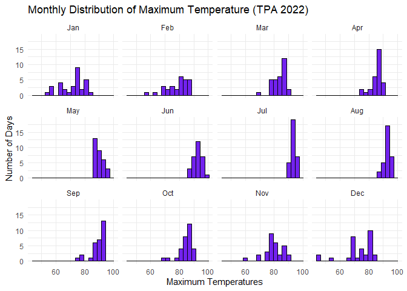
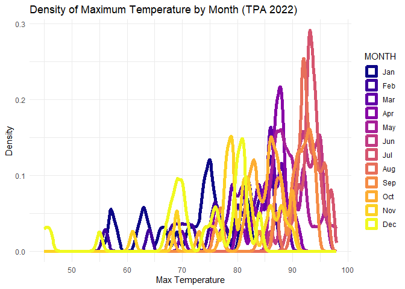
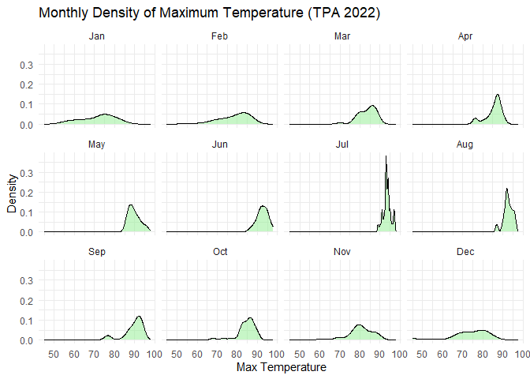
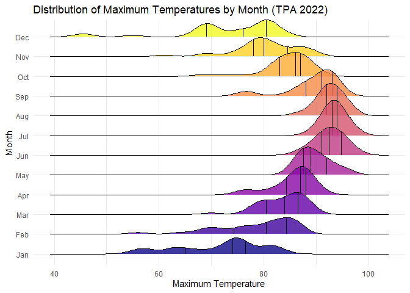
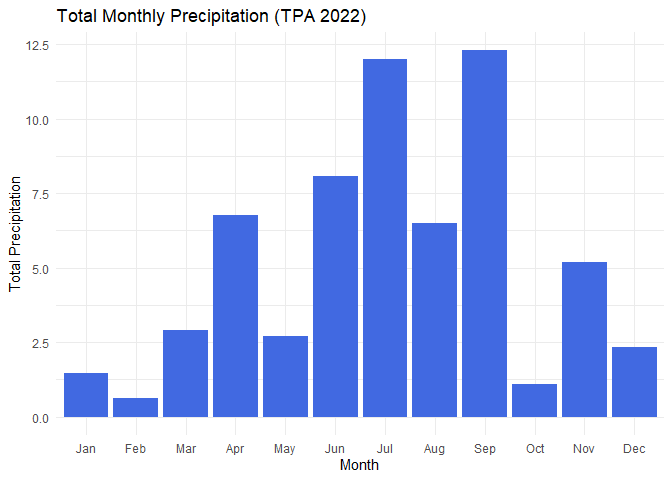
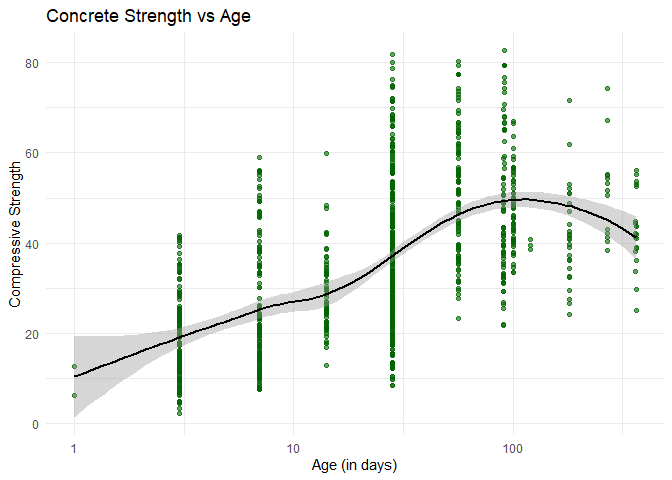
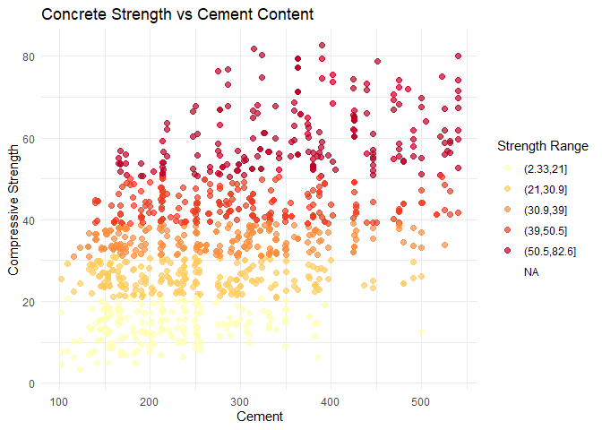

# Data Visualization Project 03


In this exercise, I explored methods to create different types of data visualizations (such as plotting text data, or exploring the distributions of continuous variables).


## PART 1: Density Plots

Using the dataset obtained from FSU's [Florida Climate Center](https://climatecenter.fsu.edu/climate-data-access-tools/downloadable-data), for a station at Tampa International Airport (TPA) for 2022. These are my plots (the ones below) that will mirror the following provided plots:


Using the 2022 data: 

(a) Create a plot like the one below:



(b) Create a plot like the one below:



(c) Create a plot like the one below:



Hint: default options for `geom_density()` were used. 

(d) Generate a plot like the chart below:


```
## Picking joint bandwidth of 1.93
```



(e) Create a plot of your choice that uses the attribute for precipitation _(values of -99.9 for temperature or -99.99 for precipitation represent missing data)_.



## PART 2 

> **You can choose to work on either Option (A) or Option (B)**. Remove from this template the option you decided not to work on. 

### Option (B): Data on Concrete Strength 

Concrete is the most important material in **civil engineering**. The concrete compressive strength is a highly nonlinear function of _age_ and _ingredients_. The dataset used here is from the [UCI Machine Learning Repository](https://archive.ics.uci.edu/ml/index.php), and it contains 1030 observations with 9 different attributes 9 (8 quantitative input variables, and 1 quantitative output variable). A data dictionary is included below: 


Variable                      |    Notes                
------------------------------|-------------------------------------------
Cement                        | kg in a $m^3$ mixture             
Blast Furnace Slag            | kg in a $m^3$ mixture  
Fly Ash                       | kg in a $m^3$ mixture             
Water                         | kg in a $m^3$ mixture              
Superplasticizer              | kg in a $m^3$ mixture
Coarse Aggregate              | kg in a $m^3$ mixture
Fine Aggregate                | kg in a $m^3$ mixture      
Age                           | in days                                             
Concrete compressive strength | MPa, megapascals


Below we read the `.csv` file using `readr::read_csv()` (the `readr` package is part of the `tidyverse`)


``` r
setwd("~/Florida Polytechnic University/Data Visualization and Reproducible Research/Dataviz_Final_Project-Main-Carlos_Molina/data") 

concrete <- read_csv("concrete.csv", col_types = cols())
```
Let us create a new attribute for visualization purposes, `strength_range`: 


``` r
new_concrete <- concrete %>%
  mutate(strength_range = cut(Concrete_compressive_strength, 
                              breaks = quantile(Concrete_compressive_strength, 
                                                probs = seq(0, 1, 0.2))) )
```

1. Explore the distribution of 2 of the continuous variables available in the dataset. Do ranges make sense? Comment on your findings.

I decided to explore the distributions for water and cement. The distribution of water content appears to be narrow and concentrated with most observations located within a small range. This reflects the engineering constraint that water-to-cement ratio is carefully controlled in concrete designs, since even small variations in water content can significantly affect the use of concrete in different constructions projects and their final compressive strength for the builds. 

The distribution of cement is skewed to the right which indicates that most concrete mixtures use moderate quantities of cement. There are a few mixtures that have high cement concentrations, but these do not drastically affect the distribution. C ement usage is not uniformly distributed across all mixes, but instead varies depending on performance requirements. Overall, the ranges for both variables are reasonable and consistent with real-world concrete engineering practices, where cement proportions vary based on strength requirements, while water content is more strictly regulated.


2. Use a _temporal_ indicator such as the one available in the variable `Age` (measured in days). Generate a plot similar to the one shown below. Comment on your results.


```
## `geom_smooth()` using formula = 'y ~ x'
```


This scatterplot shows a clear positive relationship between concrete age and compressive strength, specially during the early curing period. Strength increases rapidly in the first few days to weeks, which reflects the hydration process where cement particles react with water and form stronger bonds within the material.

However, after approximately 50–100 days, the rate of strength gain begins to slow down significantly, indicating diminishing returns over time. This downward trend is consistent with established civil engineering principles like the one says that most of the structural strength of concrete develops early, and long-term curing results in only marginal improvements.

The use of a log scale on the x-axis helps reveal this nonlinear relationship more clearly, especially the steep early growth phase. The smoothing line confirms that the relationship is not linear but follows a logarithmic-like saturation pattern. Concrete shows a rapid early curing process followed by gradual stabilization of strength over time.


3. Create a scatterplot similar to the one shown below. Pay special attention to which variables are being mapped to specific aesthetics of the plot. Comment on your results. 


```
## Warning: Removed 1 row containing missing values or values outside the scale range
## (`geom_point()`).
```


This scatterplot between cement content and compressive strength shows a generally positive relationship, meaning that higher cement content tends to correspond to stronger concrete. This aligns with fundamental mix design principles, because cement is the primary binding agent responsible for strength development in most building structure.

However, there is noticeable vertical spread at nearly all cement levels. This indicates that cement alone does not fully determine strength. There are other variables such as water content, slag, fly ash, and superplasticizer that also play a significant role in influencing the final product.

The use of strength range coloring helps reveal additional structure in the data. Lower cement levels are dominated by lower-strength categories, while higher cement values are more frequently associated with medium to high strength ranges. Concrete strength is a multivariate and nonlinear process rather than a single-variable dependency.


